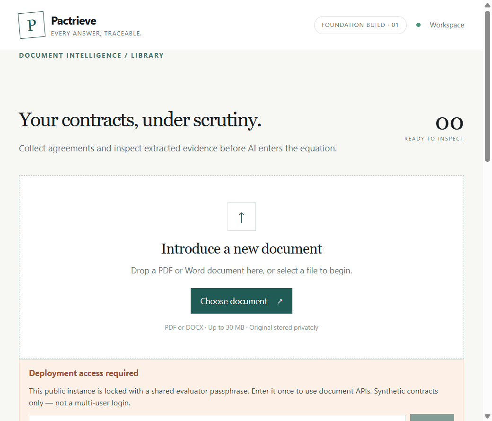
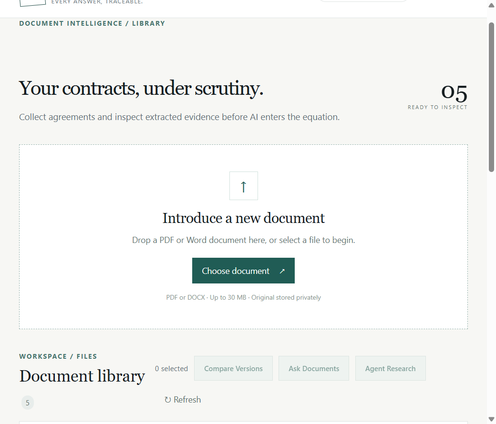
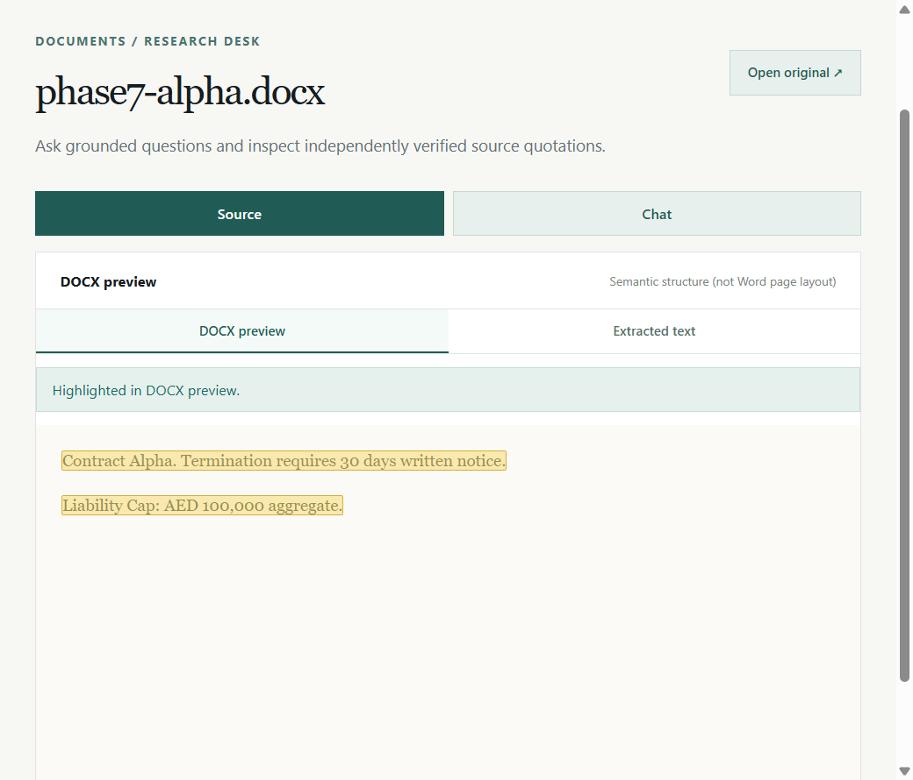
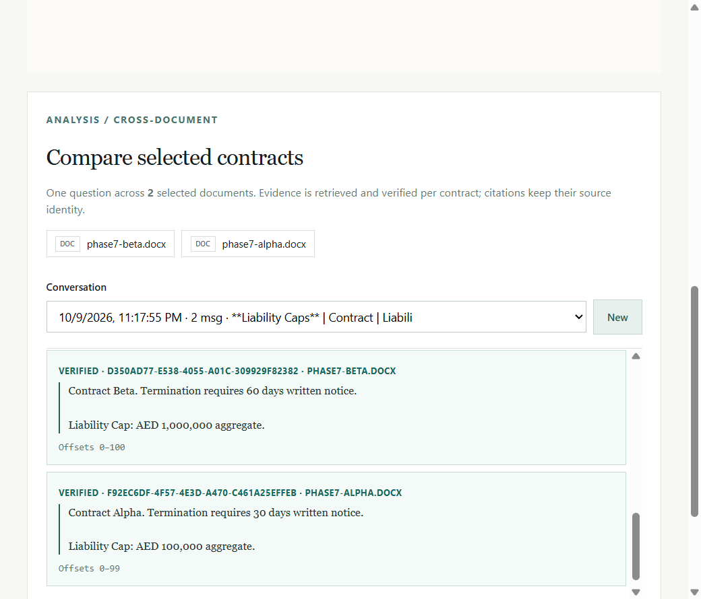
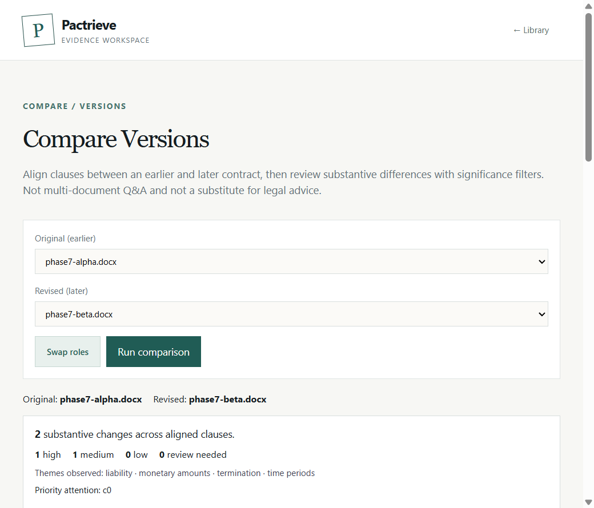
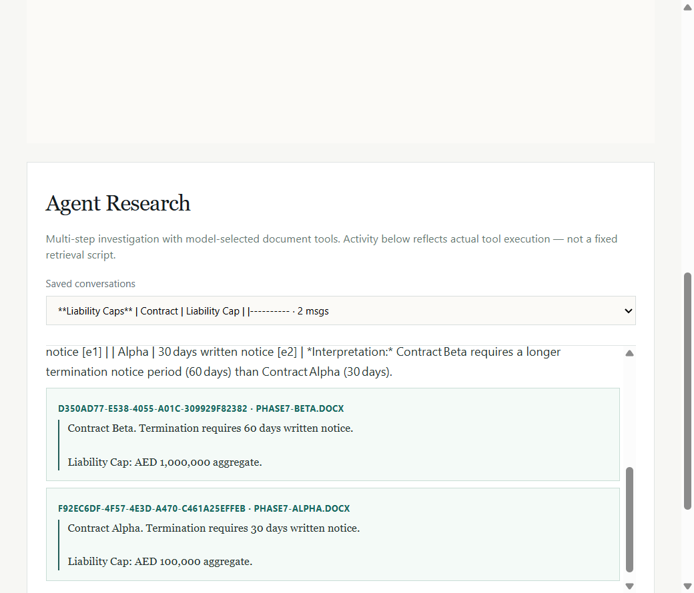

# Pactrieve

**Every answer, traceable.**

Evidence-first legal contract workspace for an SDE hiring assignment: upload PDF/DOCX, ask grounded questions, navigate verified quotations in the original source, compare versions, and run bounded agentic research.

## Live demo

- **Application:** [https://pactrieve.vercel.app](https://pactrieve.vercel.app)
- **Source:** [https://github.com/HarshYadav1711/pactrieve](https://github.com/HarshYadav1711/pactrieve)
- **Demo video:** [https://drive.google.com/file/d/12Nv6t-ZA7M_FdsCfClSaMdUZOBFDdsPs/view?usp=drive_link](https://drive.google.com/file/d/12Nv6t-ZA7M_FdsCfClSaMdUZOBFDdsPs/view?usp=drive_link)
- **Engineering note:** [`docs/ENGINEERING_NOTE.md`](docs/ENGINEERING_NOTE.md)

The live site uses a **shared evaluator passphrase** (not multi-user login). Request it through the private submission channel. Use only synthetic contracts.

## Problem

Contract Q&A systems often invent quotes or page numbers. Pactrieve separates **interpretation** (LLM) from **evidence** (deterministic verification against canonical extracted text with stable offsets).

## Capabilities

| Mode | What it does |
| --- | --- |
| **Library** | PDF/DOCX upload, processing states, delete, private originals |
| **Inspect / Ask** | Single-document grounded chat, SSE streaming, Stop + persisted partials, verified citations |
| **Ask Documents** | 2–5 docs, comparative answers, per-document evidence IDs |
| **Compare Versions** | Clause alignment, substantive summaries, severity filter/sort, SourceFocus |
| **Agent Research** | Model-selected tools (`search_documents`, `inspect_passage`, `list_document_sections`), activity timeline, verified final answer |

## Architecture (short)

1. Browser uploads via short-lived signed Supabase Storage URLs.  
2. Server extracts text → canonical source + page/offset map → retrieval chunks.  
3. Chat/agent retrieve passages → build evidence registry (`e1`…) → stream LLM → **independently verify** cited quotes → persist.  
4. Viewers map verified offsets onto PDF.js / DOCX semantic previews.

Literal quote match ≠ legal entailment. Insufficient coverage abstains rather than inventing absence.

## Stack

Next.js 16 (App Router) · TypeScript · Supabase Postgres + private Storage · PDF.js · Mammoth · Zod · OpenAI-compatible LLM (Groq in this deployment)

## Screenshots













Provenance: [`docs/screenshots/README.md`](docs/screenshots/README.md). Feature stills were captured from the same production build against synthetic fixtures when the live unlock passphrase was unavailable to the automation session; `01` is from the live URL.

## Local setup

**Node.js ≥ 22.16** (validated on 24.x).

```powershell
cd D:\Fun\pactrieve
Copy-Item .env.example .env.local
npm install
```

`postinstall` copies `public/pdf.worker.min.mjs` from `pdfjs-dist` (gitignored; required for PDF highlights).

1. Supabase SQL: `db/schema.sql`  
2. Optional helpers: `db/migrations/20261008_phase2_search_helper.sql`, `db/migrations/20261008_phase4_chat_persistence.sql`  
3. Private Storage bucket `pactrieve-documents` (≤30 MB uploads in app)  
4. Fill `.env.local` (names below — never commit secrets)  
5. `npm run dev` → http://localhost:3000  

### Environment variables

| Name | Class | Required |
| --- | --- | --- |
| `NEXT_PUBLIC_SUPABASE_URL` | Public | Yes |
| `NEXT_PUBLIC_SUPABASE_ANON_KEY` | Public | Yes |
| `SUPABASE_URL` | Server | Yes |
| `SUPABASE_SERVICE_ROLE_KEY` | **Secret** | Yes |
| `SUPABASE_STORAGE_BUCKET` | Server | No (default `pactrieve-documents`) |
| `LLM_API_KEY` / `LLM_BASE_URL` / `LLM_MODEL` | **Secret** / server | Yes for chat |
| `PACTRIEVE_ACCESS_TOKEN` | **Secret** | **Yes on Vercel** |
| `PACTRIEVE_ENFORCE_ACCESS_GATE` | Server | No (local fail-closed sim) |

On Vercel, omitting `PACTRIEVE_ACCESS_TOKEN` **fails closed** (APIs return 503). Local unset keeps APIs open for single-user development.

### Checks

```powershell
npm run typecheck
npm test
npm run build
npm start
```

## Security

- Service-role and LLM keys are server-only (never `NEXT_PUBLIC_*`).  
- Private Storage does **not** alone protect Next.js APIs — the access gate does.  
- Shared passphrase is a demo credential, not accounts.  
- Sensitive file responses use `Cache-Control: private, no-store`.

Deploy notes: [`docs/PHASE12_DEPLOYMENT.md`](docs/PHASE12_DEPLOYMENT.md).

## Engineering decisions

See [`docs/DECISIONS.md`](docs/DECISIONS.md) and the half-page [`docs/ENGINEERING_NOTE.md`](docs/ENGINEERING_NOTE.md). Highlights: independent verifier; structure-aware retrieval; real SSE + durable Stop; PDF/DOCX mapping; deterministic compare + optional grounded enrichment; bounded agent tools.

## Assignment coverage

Traceability: [`docs/REQUIREMENTS_MATRIX.md`](docs/REQUIREMENTS_MATRIX.md).

- **Part A:** Upload, library, grounded streaming chat, Stop/history, verified quotes, large-doc retrieval strategy — VERIFIED (automated + prior live).  
- **Part B:** PDF/DOCX navigation, multi-doc Q&A, version compare + significance — VERIFIED.  
- **Part C Option 2:** Agentic multi-round tools — VERIFIED in Phase 10 live Groq; re-run on production during your demo.  

## Known limitations

- No OCR for scanned PDFs.  
- Sparse 150-page fixture timing ≠ every dense commercial contract under serverless limits.  
- Clause alignment / significance are heuristics, not legal advice.  
- Agent activity timeline is stream-ephemeral (final answer + citations persist).  
- Live Groq Stop abort timing not separately proven.  
- Demo video URL not yet attached.

## Demo recording

Follow [`docs/DEMO_SCRIPT.md`](docs/DEMO_SCRIPT.md) (~4:30). Submission text: [`docs/SUBMISSION_TEMPLATE.md`](docs/SUBMISSION_TEMPLATE.md).
